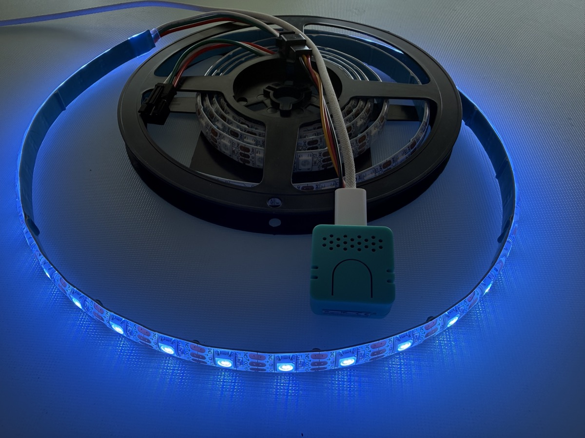
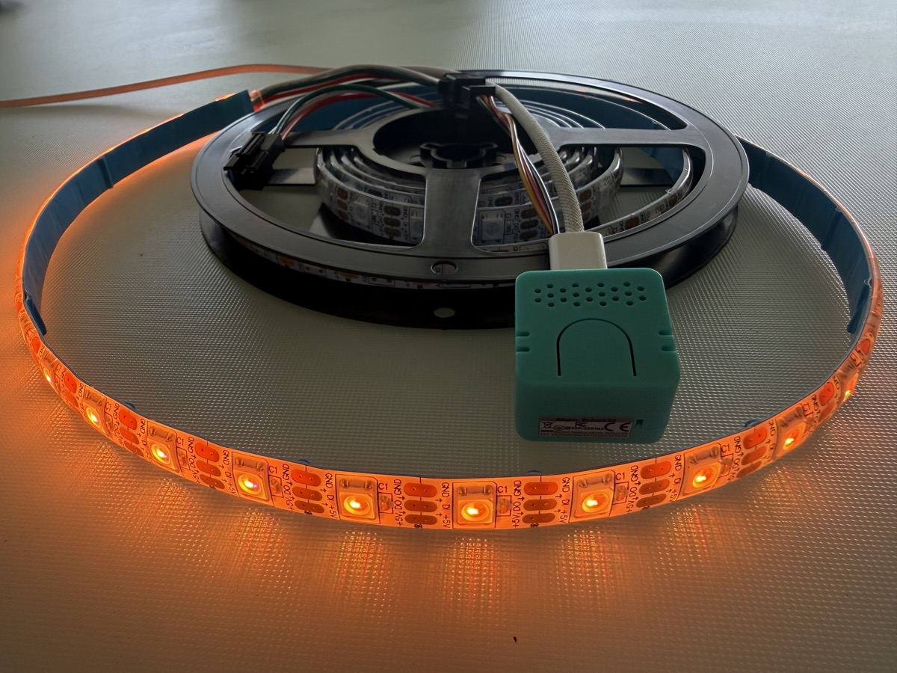

# Atom VoiceS3R — Audio‑Reactive LED Controller (ESPHome)

> Turn the **M5Stack Atom VoiceS3R / EchoS3R** into a local, microphone‑driven
> **audio‑reactive WS2812 LED controller**, a **Home Assistant media player**,
> and a **TV‑presence simulator** — all in one tiny ESP32‑S3 device, no cloud.

[](https://esphome.io)
[]()
[](https://www.home-assistant.io)
[](LICENSE)

<p align="center">
  
  
</p>

To the best of my knowledge this is the **first public ESPHome configuration that
gets the ES8311 microphone working on the M5Stack Atom VoiceS3R/EchoS3R** (the trick
is a single `channel: left` line — see [docs/architecture.md](docs/architecture.md)).
Shared freely so the next person doesn't lose an evening to it.

---

## Table of Contents
- [Features](#-features)
- [Hardware](#-hardware)
- [Wiring & Pinout](#-wiring--pinout)
- [Installation](#-installation)
- [Configuration & Usage](#%EF%B8%8F-configuration--usage)
- [How It Works (engineering notes)](#-how-it-works-engineering-notes)
- [Troubleshooting](#%EF%B8%8F-troubleshooting)
- [Roadmap](#%EF%B8%8F-roadmap)
- [Credits](#-credits)
- [License](#-license)

---

## ✨ Features

- **Real microphone audio‑reactivity** — 10 sound‑reactive LED effects driven by the
  on‑board ES8311 mic (it listens to the room; play music on any speaker and the
  strip dances to it for real).
- **Spectrum analyzer** — a real 512‑point FFT (Hann window, precomputed twiddles, auto‑gain)
  runs live in the mic handler and drives a 10‑band spectrum display: 10 frequency bands ×
  6 LEDs = 60 LEDs, each band its own color, bars rising and falling with the music.
- **TV‑presence simulator** — a non‑reactive effect that mimics the bluish‑white
  flicker of a television; from the street it looks like someone is home watching TV.
- **Westminster clock** — optional Home Assistant add‑on: the Westminster chimes at :30 and
  :00, the time spoken aloud on the hour (British English), with a warm‑gold **Bell Glow**
  light accompaniment and automatic **music ducking** (the announcement plays loud while the
  music dips, then everything returns to exactly how it was). Quiet hours 23:00–08:00. See
  [homeassistant/westminster-clock.yaml](homeassistant/westminster-clock.yaml).
- **Home Assistant media player** — `media_player.atom_speaker` plays TTS / notifications /
  Music Assistant audio through the built‑in speaker.
- **Text‑to‑Speech announcements** — type any text in Home Assistant and the device speaks it
  (Piper TTS). A ready‑to‑use `input_text` + `script` + Lovelace card:
  [homeassistant/text-to-speech-announce.yaml](homeassistant/text-to-speech-announce.yaml).
- **Ambient (non‑audio) effects** — Fireplace, Matrix Rain, Terminal, Fireworks Burst and
  Chaos for mood lighting that doesn't need the microphone.
- **On‑strip HH:MM:SS clock** — Analog / Digital / Binary, 12‑hour, time from Home Assistant;
  pick the look with the `Clock Style` select. A visual‑only, non‑reactive effect that owns
  the whole strip.
- **Smart mic ↔ amp arbitration** — the mic and speaker share one I²S bus, so the mic is
  **OFF by default** (amplifier ON) and turns ON only while an audio‑reactive effect is the
  active effect (which also frees the bus for clean media playback). No more mic/speaker
  contention.
- **Live HA controls** — `Mic Sensitivity` and `Speaker Volume` sliders.
- **On‑device G41 button** — **single click cycles the strip effect** (Clock → Fireplace → Matrix
  Rain → Terminal → Fireworks Burst → Chaos → VU Meter → Color Music → Spectrum → TV Simulator →
  Bell Glow → None → …); **double click toggles play/pause** on the `NickoScope32` Music Assistant
  media player; **long hold (≥ 1 s) ramps the strip brightness** while held, each new hold reversing
  direction (brighten ⇄ dim). No app needed to change the look, control playback, or dim the strip.
- **On‑device web interface (`web_server` v3)** — control every setting from a browser at the
  device IP (`http://<device-ip>/`): effects, Active LEDs, volumes, Clock Style and the startup
  settings below — no Home Assistant required. Controls are organized into named groups —
  🎨 Effects & Light / 🕐 Clock / 🔊 Sound / 📢 Announcements / 🚀 Startup / ⚙️ System — instead
  of one flat list.
- **Startup Effect** — a `Startup Effect` select picks which effect the strip shows on boot
  (Clock / Fireplace / Matrix Rain / Terminal / Fireworks Burst / Chaos / Spectrum / TV Simulator /
  Bell Glow / None), applied in firmware `on_boot` and restored across reboots.
- **Spoken startup greeting** — an editable `Startup Greeting` text entity (restored, 255
  chars); Home Assistant speaks it on boot via TTS. See
  [homeassistant/startup-greeting.yaml](homeassistant/startup-greeting.yaml).
- **Restart button** — a `Restart` button to reboot the device from the web interface or HA.
- **Diagnostics** — **WiFi Signal** (RSSI in dBm) and **Uptime** sensors (`entity_category:
  diagnostic`, 60 s) shown in the ⚙️ System group of the on‑device web interface and in Home
  Assistant, for at‑a‑glance link‑quality and stability checks.
- **100% local** — native HA API with encryption, OTA updates, no cloud dependency.

### Effects
| Effect | Reactive | Description |
|---|:---:|---|
| VU Meter | ✅ | Classic green→red level bar |
| Gravimeter | ✅ | Bar rises with sound, white peak falls under "gravity" (WLED‑SR style) |
| Gravcenter | ✅ | Symmetric bar from the center |
| Pixels | ✅ | Random colored sparkles, density follows loudness |
| Matripix | ✅ | Running trail, head colored by loudness |
| Color Music | ✅ | Flowing rainbow, brightness follows sound |
| Spectrum | ✅ | 10‑band FFT spectrum analyzer — 10 frequency bands × 6 LEDs, each band its own color |
| Matrix | ✅ | Green "rain", density follows sound |
| Fireworks | ✅ | Color bursts on beats |
| Strobe | ✅ | White flash on beats |
| TV Simulator | — | TV‑glow presence/occupancy simulation |
| Bell Glow | — | Warm‑gold breathing glow; light accompaniment for the Westminster chimes |
| Fireplace | — | Flickering fire / fireplace simulation (Fire2012‑style) |
| Matrix Rain | — | Continuous green "code rain" (non‑audio) |
| Terminal | — | Running cursor with a fading green trail + random "characters" |
| Fireworks Burst | — | Random colored bursts that fade (non‑audio) |
| Chaos | — | Every pixel flickers to a random color |
| Clock | — | On‑strip HH:MM:SS clock (12‑hour, time from HA); Analog / Digital / Binary via the `Clock Style` select |

The reactive effects need the microphone; the non‑reactive ones (✱ "—") are pure ambient
animations. **The mic is OFF by default and only turns ON while an audio‑reactive effect is
active** (it shares one I²S bus with the speaker), which keeps the bus free for media playback.

Full catalog: [docs/effects.md](docs/effects.md).

---

## 🧰 Hardware

| Item | Notes |
|---|---|
| **M5Stack Atom VoiceS3R** (a.k.a. Atom EchoS3R) | ESP32‑S3‑PICO‑1‑N8R8, 8 MB flash + 8 MB PSRAM, ES8311 codec, MEMS mic, NS4150B amp, 1 W speaker |
| **WS2812 / SK6812 addressable LED strip** | set `num_leds` to your strip's **physical** length; `Active LEDs` sets how many are lit |
| USB‑C data cable | first flash |
| External 5 V PSU | only if the strip is longer than ~10–15 LEDs |

Details & BOM: [docs/hardware.md](docs/hardware.md).

---

## 🔌 Wiring & Pinout

The LED strip connects to the **Grove HY2.0‑4P** port. All other pins are the
board's internal audio routing (do not reuse them).

| Signal | GPIO |
|---|---|
| **LED data (Grove, yellow)** | **GPIO2** (white = GPIO1, spare) |
| LED power / GND (Grove) | 5V / GND |
| I²S BCLK / LRCLK / MCLK | 17 / 3 / 11 |
| Mic DIN | 4 |
| Speaker DOUT | 48 |
| ES8311 I²C SDA / SCL | 45 / 0 |
| Amp enable | 18 |
| Button | 41 |

> ⚠️ The Grove 5 V rail powers only ~10–15 LEDs. For a longer strip use an external
> 5 V supply and tie its ground to the board's ground.

---

## 🚀 Installation

### Prerequisites
- [ESPHome](https://esphome.io) **2026.1 or newer** for ES8311 analog‑mic support;
  **built & verified on 2026.6** (recommended). The ESPHome add‑on in Home Assistant works great.
- A 2.4 GHz Wi‑Fi network (the ESP32‑S3 is 2.4 GHz only).

### 1. Secrets
```bash
cp secrets.yaml.example secrets.yaml
# edit secrets.yaml with your Wi-Fi + generated keys
```
Generate the API key:
```bash
python3 -c "import secrets, base64; print(base64.b64encode(secrets.token_bytes(32)).decode())"
```

### 2. First flash (USB)
The factory firmware holds the native USB, so put the board in **download mode**:
press & hold the side **Reset** button ~2 s until the internal green LED lights, release.
Then flash:
```bash
esphome run atom-voices3r-led.yaml
```
or use the web flasher at <https://web.esphome.io> (Chrome/Edge).

### 3. Adopt in Home Assistant & update over the air
The device auto‑appears under **Settings → Devices & Services → ESPHome**; add it and
paste your `api_encryption_key`. After that, update wirelessly:
```bash
esphome run atom-voices3r-led.yaml --device <device-hostname>.local
```

### Changing / recovering Wi-Fi (no reflash)
If the device can't join the configured Wi-Fi (e.g. you moved it, or changed your
router/password), it falls back to its own access point named **`Atom_Strip`**.
Connect to that AP from a phone or laptop — the standard ESPHome `wifi: ap:` +
`captive_portal:` combo then pops a web page where you can scan for networks and enter
new credentials. The device reconnects to the new network with no USB reflash needed.

The AP is password-protected; its password comes from `secrets.yaml` (`ap_password`,
8+ characters — see [`secrets.yaml.example`](secrets.yaml.example)).

> **Web interface vs. Wi‑Fi setup — what lives where (verified against ESPHome source):**
> The on‑device **web interface (`web_server`) is reachable by the device IP only while
> Wi‑Fi is connected** (`http://<device-ip>/`), and it lets you control every entity —
> but **Wi‑Fi configuration is *not* on that page**. Changing the network is done **only**
> through the **`Atom_Strip` fallback AP + captive portal**, which comes up **automatically
> when the device cannot join the configured Wi‑Fi** (e.g. you changed the router or
> password). There is **no button to force the AP while connected** — `wifi.disable` turns
> Wi‑Fi fully off (taking the web interface down with it), and Wi‑Fi fields cannot be added
> to `web_server`. So if `web_server` shows no Wi‑Fi settings, that is expected: when you
> *need* to change Wi‑Fi, the device is off your network and you reach it via the captive
> portal instead.

---

## 🎛️ Configuration & Usage

Everything below is available both in Home Assistant **and** in the on‑device web interface
at `http://<device-ip>/` (reachable while the device is on Wi‑Fi). The device exposes:

- `light.strip` — turn on, pick an effect from the dropdown.
- `select.startup_effect` — which effect the strip shows on boot (applied in firmware, restored).
- `select.clock_style` — Analog / Digital / Binary for the on‑strip Clock effect.
- `text.startup_greeting` — editable boot greeting; Home Assistant speaks it on boot via TTS
  (see [homeassistant/startup-greeting.yaml](homeassistant/startup-greeting.yaml)).
- `button.restart` — reboot the device from the web interface or HA.
- `number.mic_sensitivity` — **important**: tune this to your room. Too high pins the
  strip fully on (no swing); start around **30–40 %**. The on‑device button cycles it.
- `number.active_leds` — how many LEDs are lit (default 30). Set `num_leds` (in the YAML) to
  your strip's **physical** length so the unused tail is driven and forced **off** in every
  state — effects, a plain solid/monochrome color, or static. (A 30 ms global interval clears
  `[active, num_leds)` to black so the tail is off even with no effect selected.)
- `number.speaker_volume` — amplifier volume.
- `media_player.atom_speaker` — playback target (also add it to Music Assistant via its
  "Home Assistant" player provider).
- `sensor.mic_rms` / `sensor.mic_peak` — live mic levels.
- `sensor.wifi_signal` / `sensor.uptime` — diagnostics (WiFi RSSI in dBm, uptime), in the
  ⚙️ System group and marked `entity_category: diagnostic`.

**Announcement controls** (used by the Westminster clock, below):
- `number.announce_volume` — master volume while an announcement plays (loud; default 100 %).
- `number.announce_background` — how loud the music stays while announcing: 100 % = no
  ducking, 0 % = music muted (default 25 %).
- `switch.announce_ducking` — live ducking flag; the script flips it automatically, you do
  not toggle it by hand.

**To get music‑reactive lights:** keep `light.strip` on with a reactive effect and play
music on a normal speaker in the room — the mic does the rest.

**Westminster clock (optional):** import
[homeassistant/westminster-clock.yaml](homeassistant/westminster-clock.yaml) into Home
Assistant for chimes at :30/:00, the time spoken on the hour, ducking and the Bell Glow
accompaniment. It adds a `script.westminster_test` you can press to preview an announcement
and tune the two volume levels without waiting for the next hour.

**Spoken startup greeting (optional):** import
[homeassistant/startup-greeting.yaml](homeassistant/startup-greeting.yaml) so Home Assistant
speaks the `Startup Greeting` text via TTS whenever the device boots. The greeting text is
editable in the web interface / HA and restored across reboots; the **Startup Effect** select
is applied entirely in firmware (`on_boot`) and needs no automation.

---

## 🧠 How It Works (engineering notes)

Three non‑obvious things make this device work; full write‑up in
[docs/architecture.md](docs/architecture.md):

1. **`channel: left` on the microphone.** The ES8311 mono ADC puts its data on the
   *left* I²S slot; ESPHome defaults to *right* and reads pure silence (`-inf`).
2. **One I²S bus = mic *or* speaker, never both.** A single ES8311 codec shares the bus,
   so the config hands it off automatically around `media_player` play/stop/pause.
3. **NaN‑safe audio math.** A stopped mic can emit `NaN`; `if (nrm < 0)` does **not**
   catch NaN (all NaN comparisons are false), so the level would latch at NaN and crash an
   effect. The clamp uses `if (!(nrm > 0))` plus per‑effect guards.

---

## 🛠️ Troubleshooting

| Symptom | Cause / Fix |
|---|---|
| Mic shows `-inf`, no reactivity | Missing `channel: left` (or ESPHome < 2026.1). |
| Strip lit but not reacting | `Mic Sensitivity` too high → lower to ~30 %. |
| `Parent bus is busy` / no sound on play | Expected only if mic and speaker fight for the bus — the auto hand‑off resolves it; ensure you're on this config. |
| Media player missing in HA | Reload the ESPHome integration after adding entities. |
| OTA "connection reset" | Weak Wi‑Fi; simply retry the upload. |
| Device offline after a Wi‑Fi change | It started its fallback AP **`Atom_Strip`** — connect to it and re-enter Wi‑Fi via the captive portal (see [Changing / recovering Wi‑Fi](#changing--recovering-wi-fi-no-reflash)). |

---

## 🗺️ Roadmap

- Optional **WLED Audio Sync (UDP)** receiver to react to the *exact* track played on a
  PC (the on‑device speaker's own digital audio level is not exposed by ESPHome, so true
  "react to my media player" needs an external FFT sender).
- HA blueprint: auto‑enable **TV Simulator** when away + after dark.

### Voice assistant (experimental — not shipped)

I got a full **Home Assistant Voice (Assist) satellite** working end‑to‑end on this same board
(on‑device "Okay Nabu" wake word → Whisper STT → conversation agent → Piper TTS), but it is **not**
in the released firmware: a **Music Assistant auto‑resuming queue claims the half‑duplex I²S bus**
(`Parent bus is busy`), so the spoken reply can't reach the speaker. It's an honest experiment, not a
dead end — the full write‑up, what worked, and an **open question inviting help** are in
[docs/voice-assistant-experiment.md](docs/voice-assistant-experiment.md). If you've shipped an
EchoS3R/Atom satellite alongside Music Assistant, I'd love to hear how you avoided the bus war.

---

## 🙏 Credits

- [M5Stack](https://m5stack.com) — Atom VoiceS3R hardware.
- [ESPHome](https://esphome.io) & [Home Assistant](https://www.home-assistant.io).
- Effect ideas inspired by the [WLED](https://kno.wled.ge) Sound‑Reactive project.

## 📄 License

[MIT](LICENSE) © 2026 Nikolay Mir
